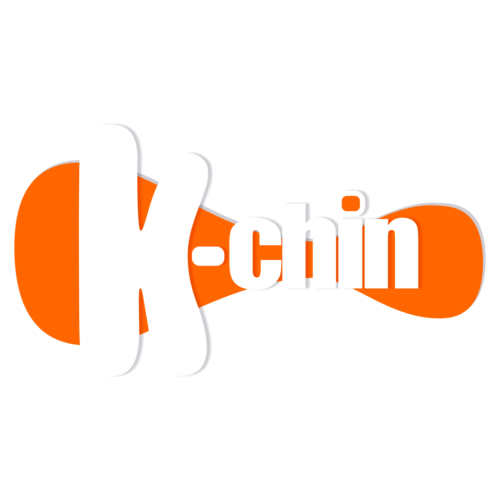
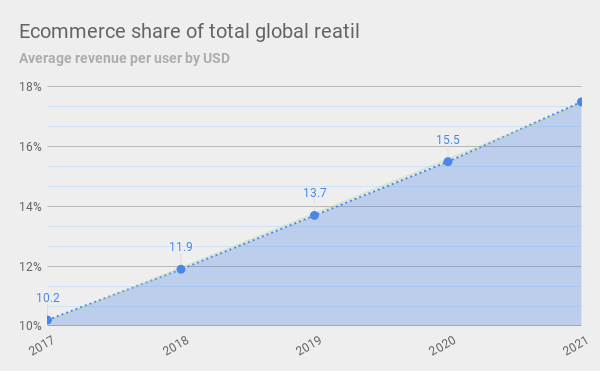
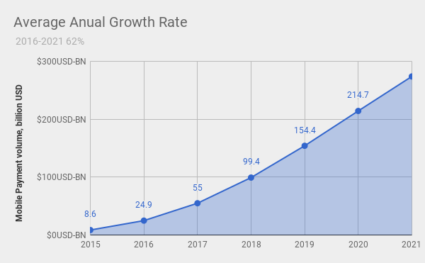
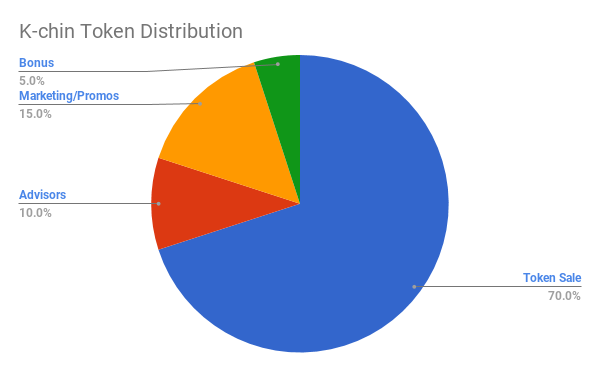

# White Paper 1.0

<p align="center">
  
</p>

## Abstract
<div style="text-align:justify;">
Currently, the e-commerce industry is in the hands of huge corporations. They generate inmense profits at the expense of your information, and your sales. The blockchain technology allows us to create networks with immutable protocols that give us true security, be the owners of our information, and be we who generate profits from it by removing the middleman.

People participate in social networks or e commerce platforms and do not get any recomposition for their participation, on the contrary they must deliver their information to a company that benefits from it and invade their privacy.

In K-chin we seek to create one network in which the benefits are shared among its users according to their contribution instead of seeking profits at the expense of user information or commissions for their sales. In order to achieve this, we developed a series of protocols that allow a network to operate transparently, decentralized and autonomously.
</div>

## Decentralized E Commerce Network
<div style="text-align:justify;">

A decentralized application or DAPP must be completely open-source, it must operate autonomously, with no entity controlling the majority of its tokens, and its data and records of operation must be cryptographically stored in a public, decentralized block chain. K-chin works on the Ethereum network and the information is hosted on the IPFS network.

In K-chin users can sell or buy products or services from other users, payments are p2p transfers either in Kchin Tokens or some other digital currency such as Bitcoin or Ethereum, including other means of payment selected by the seller, since it is a decentralized service they do not exist commissions for the sale of a product, only those imposed by the use of each network.

In a conventional e-commerce platform such as ebay or amazon, buyers trust that the company validates sellers' identities and resolves disputes that occur between the parties. Both customers and sellers deliver their information to the company based solely on trust. In K-chin each user retains control of their information encrypted and saves it to the blockchain and can only be accessed through their private key that only he and nobody else has. When a transaction is performed, the users involved must perform a proof of identification to each other. The transaction is saved and signed with the proof of identity. All transactions are registered by an immutable hash.

K-chin may adapt its protocol in response to proposed improvements and market feedback but all changes must be decided by majority consensus of its users.

So, if the network is owned by all the members of the network  What is the role of the founders and the development team?

K-chin is released as a free resource, the founders and the development team actively contribute to the development of functions and services to improve the user experience, the security and better financial services.

Everyone can contribute to the development of applications and services within the network, this encourages competition and constant improvement of technology, just as Google allows developers to contribute to their platforms through applications, but in K-chin the developers, as well as Vendors and Customers receive one hundred percent of their profits and rewards and own their information.
</div>

## How it works

### K-chinID
<div style="text-align:justify;">
To be able to participate on the K-chin network users must create a ```K-chinID```, which is a non fungible ```ERC721 Token```
that represents the id of a vendor, customer or developer on the network
</div>

* **Solidity K-chinID Struct:** The user ```K-chinID``` is stored in a struct object in the smart contract

```Solidity
struct ID{
  bytes32 name;
  bytes32 hash;
  uint256 none;
}
```

* **Javascript K-chinID Object:** The ```K-chinID``` is composed by a ```json object``` which cointaines all the vendor data.

```javascript

var vendorID = {
  owner:'0x000'//Ethereum Address of the owner
  name:'Name',
  last_name:'Last Name',
  email:'email',
  picHash:'pic hash',//the immutable hash of picture hosted on ipfs
  id:{//this key is stored encrypted by IdentityKey
    official_id_number:'000000',
    birth_date:'some birthday string',
    address:{
      line1:'street number',
      line2:'colony',
      country:'country code'.
      state:'state',
      postal_code:'0000'
    }
  }
}
```
### Proof of Identity
<div style="text-align:justify;">
In order to create a healthy, transparent and legality-based network, it is necessary that all sales transactions in the network can be consulted in a public way and that certain information remains encrypted.

Every id on the network will be validatedby K-chin and the holder of the id token is the owner of the address.
</div>

### Product Object.
<div style="text-align:justify;">
K-chin is a Decentralized E commerce Network, that means that each user must be able to publish products or services and accept payments for it.

A vendor will be able to create products and publish to the ipfs decentralized network and reference it to a struct stored in the K-chin Smart Contract. The vendor also needs to have some $KCT balance.
</div>

* **Solidity product struct:** The product struct is composed by the ethereum address of the vendor, this address must be the same address used to create the K-chinID, a hash of the product data stored in IPFS decentralized network and a unix timestamp.

```javascript
//Solidity product struct
struct product {
  address owner;
  bytes32 hash;
  uint256 none;
}
```

* **Javascript product object:** The product object is composed by the data of the product.

```javascript
//product object
var product = {
  title:'product title',
  description:'product description',
  price:'product price in local currency',
  country:'product country location',
  state_province:'state or province',
  pictures:[],//hashes of stored pictures or media of the product
  payment_methods:{ //this is hashed and only is shown when customer purchase the product
    payment_addresses:[
      {method:'method', data:'some_address'}
    ]//Eth, BTC, LTC, or any other address where this product will recieve it's payments
  }
}
```
### K-chin Token
The K-chin Token (KCT) is an ethereum ERC20 token used in the K-chin network as a reward, proof of participation and digital currency.

* **K-chin Token as digital currency**
KCT is a liquid currency, and therefore can be bought or sold on exchanges, as well as transferred to other users as a form of payment.

* **K-chin Token as reward**
Vendors can reward their customers with K-chin tokens for their purchases or good reviews.

* **K-chin Token as proof of participation**
Owning the tokens is a proof that this address is a participant of the network, this helps to prevent the spam products or fraudulent vendors.

## Market Oportunity
Ecommerce market share in 2018, as a percentage of all retail sales, is expected to increase to 11.9% — up from 3.5% a decade ago. Global Retail Ecommerce Sales Will Reach $4.5 Trillion by 2021.

The opportunity is even greater when you consider thar global B2B ecommerce sales are set to exceed $7.7 trillion in 2018, tiple that of B2C ecommerce.

<p align="center">
  
</p>
Fast growth plus relatively low market share means that there is still enormous opportunity for new players to outpace traditional industry leaders.

### There are huge changes on the way.
<div style="text-align:justify;">
According to Boston Consulting Group, the payment industry is about to experience a huge shift towards mobile payments:

* Mobile payment volume was USD 8.6 billion in the US. It is expected to increase tenfold by 2021 to reach $274bn only in US.
* Mobile share of total ecommerce is expected to increase to 48.5% of total e-commerce by 2020. It was 23.6% in 2015.
* Merchant mobile payment acceptance network to grow 10X by 2020: Mobile based payment solutions and proprietary payment networks will drive merchant acquisition by offering low-investment solutions that will create economic incentives for merchants and acquirers, resulting in over 10 million merchant establishments that will accept digital/mobile payments.

* Technology will make digital payments simpler: smartphone penetration, blockchain and crypto currencies, ubiquitous connectivity, biometrics, tokenization, cloud computing, and the Internet of Things are a few trends that will shape the way consumers will transact in the future.

Mobile payment volume is expected to increase to $274bn by 2021 in the US alone. Chinese mobile payments were nearly 50 times greater than those in the US last year, according to Financial Times.
</div>

<p align="center">
  
</p>

### Data breach and privacy
<div style="text-align:justify;">
Today more than ever, users of digital services know that their information has a value, and that said value is being exploited by third parties. In addition, there is a growing number of users who are concerned about the way in which companies use and with whom they share their data.

This aspect provides a wide opportunity for the blockchain industry since it allows users to keep the property and privacy of their information and at the same time all the movements within the network are public and auditable, which helps to avoid misuse and the inappropriate contents and behaviors.
</div>

## Business Model
<div style="text-align:justify;">
Decentralization and web 3.0 change the rules of the game and the way in which businesses create their revenue streams. Being a decentralized network, where each user keeps their information and in which transactions are peer to peer, charging fees for transactions between users for sales is dishonest.

K-chin is a market open to all, but as in any market, there are services that are required, our company develops different products that allow users to perform different operations within the K-chin network.
</div>

### Our Products
* **Web Service**
It allows users to connect to the network and consume resources through a user interface in mobile and web application.

* **Developer Framework**
Provides a standard way to build and deploy applications on the K-chin Network.

* **Exchange**
In order to cash out your earnings you can opt for using the K-chin exchange.

## Token Sale
<div style="text-align:justify;">
The KCT crowdsale and the corresponding token creation process will be issued by Kchin decentralized E-Commerce ecosystem, utilizing smart contracts running on Ethereum. Participants who are willing to support the development of the UHub Project can do so by sending Ethereum to the designated address on the system. By doing so, participants are purchasing Kchin Tokens (KCT) at the rate of 100000KCT per 1 ETH which are sent instantly to their Wallet through a smart contract on the Ethereum blockchain.
</div>

* The only cryptocurrency accepted in the ICO campaign is Ethereum.
* Tokens will be mined as are purchased so the total supply will be porportional to raised ether.

## Token Distribution

<p align="center">
  
</p>
